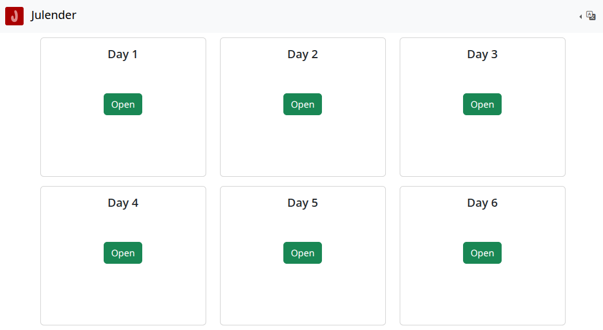

# Julender
[](https://github.com/manuelmaurer/julender/actions/workflows/ci.yml)
[](https://github.com/manuelmaurer/julender/actions/workflows/build.yml)
[](https://github.com/manuelmaurer/julender/actions/workflows/ci.yml)
[](https://github.com/manuelmaurer/julender/actions/workflows/ci.yml)


PHP Advent Calendar based on slim4



## Docker installation
You can pull the docker image from either Github or Docker:
### Github
```bash
docker pull ghcr.io/manuelmaurer/julender:latest
docker run -d -p 8080:80 -v /path/to/images:/var/www/html/media ghcr.io/manuelmaurer/julender:latest
```
### Docker
```bash
docker pull manuelmaurer/julender:latest
docker run -d -p 8080:80 -v /path/to/images:/var/www/html/media manuelmaurer/julender:latest
```
Naviate to http://localhost:8080 to access the calendar. See [Configuration](#Configuration) on how to customize.

## Manual installation
- Download the latest release from [releases](https://github.com/manuelmaurer/julender/releases) and extract it to your webserver.
- Run `composer install` in the extracted folder.
- Point your webserver to the public folder inside the extracted folder.

## Configuration

The calendar requires 24 images (named 01 through 24) to be placed in the [media/](media/) folder
(or in the volume mount in case of docker) which will be served on the respective day.
The mime type is automatically detected when delivered to the browser.


You can customize the calendar by editing either setting environment variables or by creating a configuration file at `config/config.local.php`.

| Env Variable     | config file | Description                           | Default Value |
|------------------|-------------|---------------------------------------|---------------|
| JUL_TITLE        | title       | Title of the calendar                 | Julender      |
| JUL_TIMEZONE     | timezone    | Timezone the calendar runs in         | Europe/Berlin |
| JUL_LANGUAGES    | languages   | Languages available for the calendar  | en,de         |
| JUL_ADVENT_MONTH | adventMonth | Month of the advent calendar          | 12            |
| JUL_PASSWORD     | password    | Password for the admin panel          | <null>        |
| JUL_DEBUG        | debug       | Enable debug mode                     | false         |
| JUL_DATE_FORMAT  | dateFormat  | Date format for the calendar          | Y-m-d         |

### Detailed description of the configuration options
`JUL_TITLE` / `title`
: The title of the calendar. It will be shown in the browser tab and in the header bar.
: **Important** You might want to localize your title, see [Languages](#Languages) for details

> Default value: Julender

`JUL_TIMEZONE` / `timezone`
: The timezone you want the calendar to run in. The doors open on midnight of the configured timezone.

> Default value: Europe/Berlin

`JUL_LANGUAGES` / `languages`
: A comma separated list of languages available for the calendar.
: **Important** See the [Languages](#Languages) section for details 

> Default value: en,de

`JUL_ADVENT_MONTH` / `adventMonth`
: The month of the advent calendar.

> Default value: 12

`JUL_PASSWORD` / `password`
: The password to access the calendar. Set to <null> to allow public access.

> Default value: <null>
 
`JUL_DEBUG` / `debug`
: Enable debug mode. This will configure the following Options:

- Detailed error messages using [Whoops](https://github.com/filp/whoops)
- Disable Twig cache

> Default value: false

`JUL_DATE_FORMAT` / `dateFormat`
: Date format for the calendar. This will be used to display the delta for each door when it will open. Format string
must comply to [DateInterval::format](https://www.php.net/manual/en/dateinterval.format.php)

> Default value: Y-m-d

## Languages

The calendar supports multiple languages through translation files. The default language is english (en).
You can add additional translation strings by adding a `<lang>.local.php` file to the [translations/](translations/) folder.
See [translations/local.example.php](translations/local.example.php) for an example.

For more details and on how to add a complete new language, see [documentation/translation.md](documentation/translation.md)

## Bugs / Problems
Please report any bugs or problems to the [issue tracker](https://github.com/manuelmaurer/julender/issues).

## Development
See [documentation/development.md](documentation/development.md)
